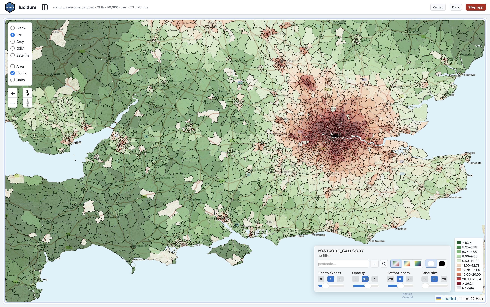
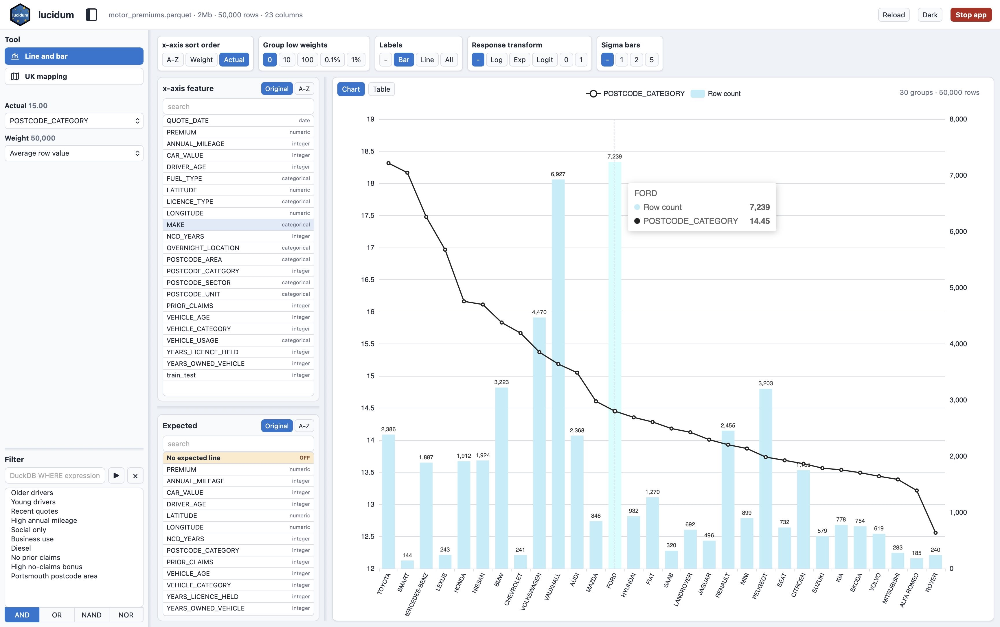

# lucidum

`lucidum` is a local browser workbench for exploring CSV and Parquet datasets. It starts a small FastAPI server, uses DuckDB for live profiling and aggregation, and opens an interactive UI for column summaries, grouped charts, filters, and UK postcode maps.

The current app includes:

- A combined line-and-bar chart over any dataset feature.
- One or two response lines with a shared Weight selector.
- A column profile table with filtered missing counts, distinct counts, and ranges.
- Numeric fixed-width or quantile banding, date buckets, low-weight grouping, table view, and saved filters.
- UK postcode area and sector choropleths using bundled GeoJSON assets.
- UK postcode unit points using dataset latitude/longitude columns.
- Optional token-protected local URLs and a browser Stop app button.

The repository includes one synthetic demo dataset at `datasets/motor_premiums.parquet`, and installed packages include the same file for `lucidum --demo`.

<details>
<summary><strong>Installation</strong></summary>

  <h2>Installation</h2>

  From the project root:

  ```bash
  python3.13 -m venv .venv
  .venv/bin/python -m pip install --upgrade pip
  .venv/bin/python -m pip install -e .
  ```

  This installs the `lucidum` command.

  <h3>Install once with pipx</h3>

  Use `pipx` if you want the `lucidum` command available from any project without activating this repository's `.venv`.

  `pipx` supports macOS, Linux, and Windows. The examples below use macOS/Linux shell syntax; on Windows, follow the official `pipx` Windows installation notes and use Windows paths. Lucidum requires Python 3.13 or newer.

  Install `pipx` once:

  ```bash
  brew install pipx
  pipx ensurepath
  ```

  Restart the terminal after `pipx ensurepath`, then install Lucidum from a local checkout:

  ```bash
  pipx install --python python3.13 /path/to/py_lucidum
  ```

  Or install from GitHub once the repository is available there:

  ```bash
  pipx install --python python3.13 git+https://github.com/SpeckledJim2/py_lucidum.git
  ```

  After that, launch any CSV or Parquet file from any project directory:

  ```bash
  lucidum some_file.parquet --open
  lucidum some_file.csv --open
  ```

  If `lucidum` is not found, either restart the terminal after `pipx ensurepath` or run the command directly from `~/.local/bin/lucidum`.

  If `pipx install` uses an older default interpreter, force `pipx` to use Python 3.13:

  ```bash
  rm -rf ~/.local/pipx/shared
  PIPX_DEFAULT_PYTHON=python3.13 pipx install --force --python python3.13 /path/to/py_lucidum
  ```

  This is a per-user install, which is usually preferable to installing into the system Python with `sudo pip`.

</details>

<details open>
<summary><strong>Usage, Features, and Development</strong></summary>

  <h2>Demo Screenshots</h2>

  

  *UK postcode sector mapping using the bundled motor premiums dataset.*

  

  *Line-and-bar analysis using the bundled motor premiums dataset.*

  <h2>Quick Start</h2>

  Launch the bundled demo dataset:

  ```bash
  .venv/bin/lucidum --demo --port 8000
  ```

  The command prints a URL like:

  ```text
  Open http://127.0.0.1:8000/?token=...
  Saved filters: specs/filter_spec.csv
  KPIs: specs/kpi_spec.csv
  Uvicorn running on http://127.0.0.1:8000/?token=... (Press CTRL+C to quit)
  ```

  Open the full printed URL in your browser. Stop the server with `Ctrl+C` in the terminal or the red `Stop app` button in the browser header. In either case, an open browser tab greys out and shows a stopped message once the local server is gone.

  From a source checkout, the same data can also be loaded directly:

  ```bash
  .venv/bin/lucidum datasets/motor_premiums.parquet --port 8000
  ```

  <h2>Running Your Own Data</h2>

  Pass a CSV or Parquet file path:

  ```bash
  .venv/bin/lucidum path/to/my_data.parquet --port 8000
  .venv/bin/lucidum path/to/my_data.csv --port 8000
  ```

  If you installed Lucidum with `pipx`, run it from any project directory without the `.venv/bin/` prefix:

  ```bash
  lucidum path/to/my_data.parquet --open
  lucidum path/to/my_data.csv --open
  ```

  Parquet is recommended for normal use because DuckDB reads it much faster than CSV.

  If your UK mapping columns use different names, pass them explicitly:

  ```bash
  .venv/bin/lucidum path/to/my_data.parquet \
  --postcode-area Area \
  --postcode-sector Sector \
  --postcode-unit Unit \
  --latitude latitude \
  --longitude longitude
  ```

  <h2>Common Options</h2>

  ```bash
  .venv/bin/lucidum --demo --open --port 8000
  .venv/bin/lucidum --demo --host 0.0.0.0 --port 8000
  .venv/bin/lucidum --demo --no-token
  .venv/bin/lucidum --demo --x DRIVER_AGE --actual PREMIUM --denominator ANNUAL_MILEAGE
  .venv/bin/lucidum --demo --filters specs/filter_spec.csv
  .venv/bin/lucidum --demo --no-filters
  .venv/bin/lucidum --demo --kpis specs/kpi_spec.csv
  .venv/bin/lucidum --demo --no-kpis
  .venv/bin/lucidum --demo --tools line-bar
  ```

  - `--open` asks Python to open the generated URL with its configured browser or viewer handler.
  - `--host 0.0.0.0` binds to all network interfaces for LAN testing. Keep the generated token enabled unless you have another access control layer.
  - `--no-token` disables URL/API token protection for local-only use.
  - `--x`, `--actual`, `--expected`, and `--denominator` set initial chart selections.
  - `--filters` points to a saved-filter CSV file. By default the app tries `./filter_spec.csv`, then `./specs/filter_spec.csv`.
  - `--no-filters` disables saved-filter discovery.
  - `--kpis` points to a KPI spec CSV file. By default the app tries `./kpi_spec.csv`, then `./specs/kpi_spec.csv`.
  - `--no-kpis` disables KPI spec discovery.
  - `--tools` selects enabled tools. By default `column-profile`, `line-bar`, and `uk-map` are enabled.

  UK map columns default to `PostcodeArea`, `PostcodeSector`, `PostcodeUnit`, `lat`, and `long`. Uppercase aliases such as `POSTCODE_AREA`, `POSTCODE_UNIT`, `LATITUDE`, and `LONGITUDE` are also detected.

  <h2>Python Usage</h2>

  Launch the demo from Python:

  ```python
  import py_lucidum

  py_lucidum.serve(py_lucidum.demo_dataset_path(), port=8000, open_browser=True)
  ```

  Launch your own Parquet dataset the same way:

  ```python
  import py_lucidum

  py_lucidum.serve("path/to/my_data.parquet", port=8000, open_browser=True)
  ```

  CSV files are also supported:

  ```python
  py_lucidum.serve("path/to/my_data.csv", port=8000, open_browser=True)
  ```

  In notebook-style runtimes such as Positron or Jupyter, `serve()` starts the server in the background and returns the URL immediately. In a normal Python shell, it blocks until stopped.

  Programmatic launches accept the same KPI spec controls as the CLI, using `kpis` or `kpis_path` for a CSV path and `no_kpis=True` or `use_kpis=False` to disable KPI discovery.

  To launch only the line-and-bar tool, pass either the demo path or your own dataset path:

  ```python
  import py_lucidum

  py_lucidum.serve_line_bar(py_lucidum.demo_dataset_path(), port=8000, open_browser=True)
  py_lucidum.serve_line_bar("path/to/my_data.parquet", port=8000, open_browser=True)
  ```

  For ASGI usage, pass the same kind of dataset path to `create_app()`:

  ```python
  import py_lucidum
  from py_lucidum.app import create_app

  app = create_app(
    py_lucidum.demo_dataset_path(),
    token="dev-token",
    defaults={
        "x": "DRIVER_AGE",
        "actual": "PREMIUM",
        "denominator": "ANNUAL_MILEAGE",
    },
    filters_path="specs/filter_spec.csv",
    kpis_path="specs/kpi_spec.csv",
    tools=["column_profile", "line_bar", "uk_map"],
  )

  py_lucidum.run_app(app, host="127.0.0.1", port=8000, open_browser=True)
  ```

  <h2>Features</h2>

  **Column profile**

  - Review every dataset column in a filtered profile table.
  - See inferred type, missing count, exact distinct count, and min/max for numeric and date columns.
  - Inspect detail counts for numeric zeros and categorical blank strings separately from missing values.
  - The profile respects the same footer and saved filters as the chart and map tools.

  **Line and bar chart**

  - Select any feature for the x-axis.
  - Select Actual and optional Expected numeric response lines.
  - Use `Average row value` or a numeric Weight column as the denominator.
  - Bucket numeric axes with fixed-width bands or quantiles, bucket date axes, collapse low-weight groups, switch between chart and table views, and apply optional response transforms.

  **UK mapping**

  - Switch to UK mapping from the sidebar tool selector.
  - Show postcode area or sector choropleths, plus postcode unit points when unit and coordinate columns are available.
  - Use the floating map control for postcode search, palette selection, blank-map background, line thickness, opacity, hot/not-spot highlighting, and polygon labels.

  **Filters and saved filters**

  The footer filter box accepts DuckDB `WHERE` expressions:

  ```sql
  DRIVER_AGE > 40
  ANNUAL_MILEAGE >= 20000
  VEHICLE_USAGE = 'Social only'
  QUOTE_DATE >= DATE '2017-01-01'
  ```

  Saved filters are grouped CSV files with exactly these columns:

  ```csv
  theme,name,expression
  MODEL SPLIT,Training rows,train_test = 0
  MODEL SPLIT,Test rows,train_test = 1
  DRIVER AGE,Young drivers,DRIVER_AGE < 30
  DRIVER AGE,Older drivers,DRIVER_AGE > 70
  POSTCODE AREA,Portsmouth,POSTCODE_AREA = 'PO'
  MILEAGE,High annual mileage,ANNUAL_MILEAGE >= 20000
  ```

  Saved-filter rows can be used in `Single` mode, where each click clears other saved filters, `Multi` mode, where each click toggles only that row and selected rows combine using the active All/Any/Not all/None mode, or `Grouped` mode, where rows within each theme combine with `OR` and selected themes combine with `AND`. The generated expression is written to the footer expression box.

  **Performance timings**

  The footer shows approximate diagnostic timings for the active tool, for example `DuckDB: 430us, JSON: 2ms, Profile render: 25ms, Total: 27ms`, `DuckDB: 430us, JSON: 3ms, Chart render: 147ms, Total: 150ms`, or `DuckDB: 1435ms, JSON: 256ms, Map render: 877ms, Total: 2568ms`. Timing values can use `ns`, `us`, or `ms` depending on the measured duration. `DuckDB` is measured on the Python server for the active tool API request. UK maps use a route-local DuckDB execute/fetch timer so the footer can show whether the database query is the bottleneck. This does not include browser-to-server network latency, JSON transfer or parsing, profile table rendering, chart drawing, map drawing, GeoJSON loading, or map tile loading.

  `Profile render` is measured in the browser after column summaries arrive, while updating the profile table. `Chart render` is measured in the browser after data has arrived, while updating the Line/Bar chart and table UI. `Map render` is measured in the browser after data and the required GeoJSON are available, while updating the Leaflet map layers, legend, and labels. All tools also show `JSON` and `Total`: `JSON` covers response body read plus JSON parsing, and `Total = DuckDB + JSON + render` using the rounded millisecond values shown in the footer. Cached UI rerenders can update the render timing without running a new DuckDB query, so the DuckDB value may be the last cached query time. Collapsing the filter footer hides the timing monitor along with the filter input.

  **KPIs**

  KPI specs are grouped CSV files with exactly these columns:

  ```csv
  group,name,actual,denominator,decimals,format
  VEHICLE,Vehicle age,VEHICLE_AGE,N,1,number
  DRIVER,Driver age,DRIVER_AGE,N,1,number
  FINANCIAL,Premium,PREMIUM,N,2,currency
  ```

  `denominator` accepts `N`, `Average row value`, an empty value, or `__none__` for average row value, or any numeric column name for weighted response values. `format` accepts `number`, `currency`, or `percent`; percent formatting treats `0.1` as `10%`. Selecting a KPI in the sidebar sets the Actual and Weight controls and applies the KPI decimals/format to response values in the line/bar chart and UK map.

  <h2>Development</h2>

  Run the standard test suite:

  ```bash
  .venv/bin/python -m unittest discover -s tests
  ```

  Useful checks before committing:

  ```bash
  .venv/bin/python -m compileall src tests
  node --check src/py_lucidum/static/app.js
  git diff --check
  ```

  Optional browser smoke tests require Playwright and Chromium:

  ```bash
  .venv/bin/python -m pip install pytest pytest-playwright
  .venv/bin/python -m playwright install chromium
  PY_LUCIDUM_RUN_BROWSER_TESTS=1 .venv/bin/python -m pytest tests/test_browser_smoke.py
  ```

  Optional `pipx` install test creates an isolated temporary `pipx` environment, installs the local checkout, and verifies the installed `lucidum` command can launch a CSV from another directory:

  ```bash
  PY_LUCIDUM_RUN_PIPX_INSTALL_TESTS=1 .venv/bin/python -m pytest tests/test_pipx_install.py
  ```

  If your default `pipx` interpreter is not Python 3.13, point the test at Python 3.13:

  ```bash
  PY_LUCIDUM_RUN_PIPX_INSTALL_TESTS=1 \
  PY_LUCIDUM_PIPX_PYTHON=python3.13 \
  .venv/bin/python -m pytest tests/test_pipx_install.py
  ```

  Maintainer and architecture notes live in `DEVELOPMENT.md`.

</details>
