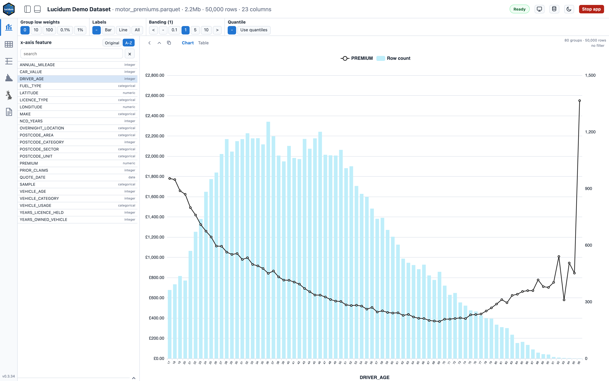
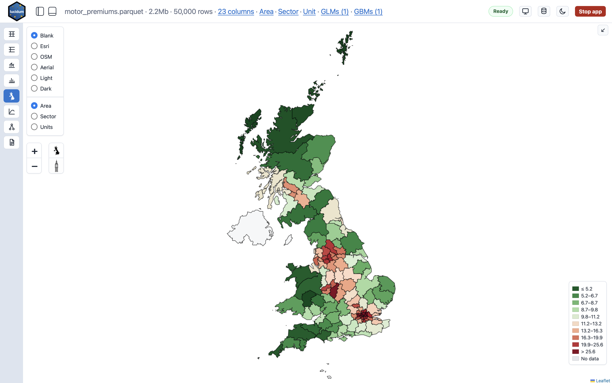
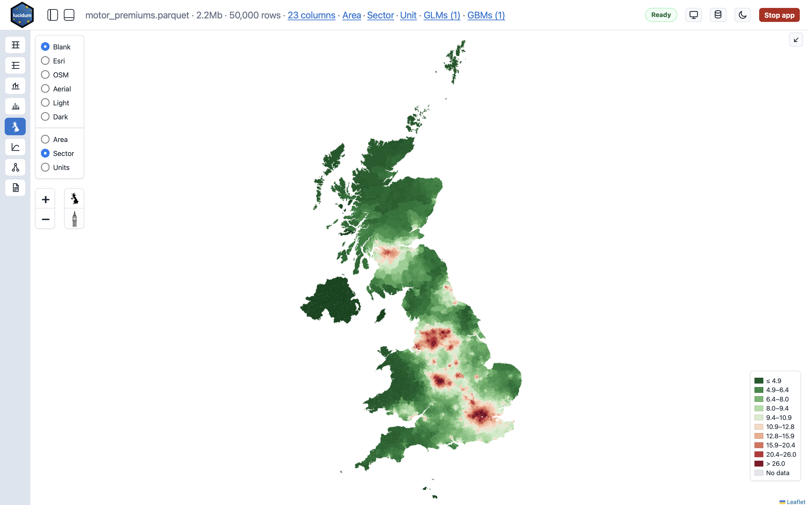
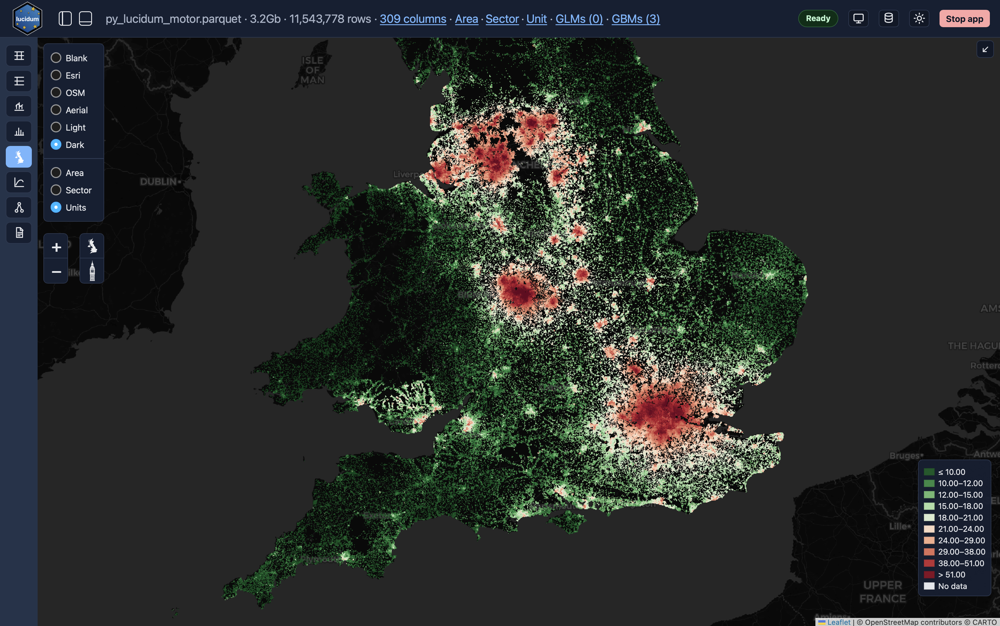

# lucidum

`lucidum` is a local browser workbench for exploring CSV and Parquet datasets. It starts a small local FastAPI server, reads data with DuckDB, and opens an interactive UI for profiling columns, plotting grouped metrics, applying filters, and mapping UK postcode data.

The app is designed for local analysis: your dataset stays on the machine running `lucidum`.

## Current Tools

- **Dataset Viewer**: inspect a fast filtered preview of dataset rows in a sortable Tabulator grid, capped at 100 displayed rows, with client-side whole-table search, axis-exclusive whole-row or whole-column selection, transpose mode where search matches original column-name rows while keeping all preview row columns, optional alphabetical column ordering, right-click column pinning that marks pinned names, lists pinned columns above the grid, and keeps pinned columns first and visible during column search without frozen or sticky cells, saved Dataset view favourites including sort state, right-click cell copy, and right-click CSV copy for selected rows or columns.
- **Column Profile**: review dataset columns, missing values, distinct counts, ranges, value counts, and numeric/date distributions. Large datasets open with a fast preview summary and can be recalculated on all rows. Right-click a column row to copy the feature name.
- **Line and Bar**: plot grouped Actual and up to two optional Expected response values over one or two features in a full-bleed chart/table workspace. Its scrollbar-free settings strip uses edge fades to mark off-screen controls and supports horizontal trackpad/touch gestures, keyboard focus scrolling, and ordinary vertical mouse-wheel scrolling. One-feature views retain the existing line/bar controls, including sorting, transforms, sigma bars, SHAP ribbons, and GLM partial-dependence overlays. A plain feature click always makes that row the sole Feature 1; Command-click another feature on macOS, or Ctrl-click it on Windows/Linux, to add or remove Feature 2 without disabling the remaining rows. The double-ended arrow beside the x-axis heading swaps the two features together with their independent grouping controls in one refresh. Two untreated continuous numeric/date groupings render a surface whose axes use the exact plotted data ranges and whose 3D footprint expands responsively on wider chart areas, continuous/factor groupings render colour-matched response lines with stacked Weight/N bars, and factor/factor groupings render a heatmap whose category axes independently suppress tick labels that cannot fit at the 8px legibility floor while retaining axis titles and tooltips. Dates are continuous by default, use chronological date-aware line/surface axes, and expose `Treat as factor` alongside their independent calendar bucket so the same pair can switch to lines or a heatmap. Numeric features expose the same override alongside independent banding and quantile controls. A one-feature `Missings — Show / Hide` control, or one independent control per feature in two-feature mode, either retains missing groups or removes raw rows missing that feature from the Line/Bar analysis. Shown missing-volume bars use pale grey. Hide recalculates the Line/Bar chart, table totals, transforms, overlays, pagination, and displayed Line/Bar row count, but the shared sidebar Numerator and Denominator values remain based on the global filter so switching tools does not change their meaning. Numeric tails Winsorise fixed-width values at that feature's percentile cutoffs; categorical tails combine at least two marginal levels at or below the chosen share of filtered Weight/N into `Other`. In one-feature ordered low-weight grouping, shown missings stay separate and do not consume either tail, although percentage thresholds still use total included Weight/N. Quantile, date, and unbanded numeric groupings ignore two-feature Tail grouping. Mixed line/bar plots always show volume and offer a cached Plot chooser only when multiple response values are available; surfaces and heatmaps show one chosen response or Weight/N at a time. Factor/factor heatmaps accept up to 100,000 populated grouped cells; other Line/Bar charts retain the 10,000-group guard. Heatmaps offer cached `-`, `Actual`, `Weight`, and, where two lines fit, `Both` cell labels, using active-KPI response formatting, contrast-aware text colours, and responsive font sizing. Each label mode remains available at larger category counts whenever its formatted text still fits at the separate 7px cell-label floor. The server-backed table keeps both feature columns and every selected response. The tool also supports a shared Denominator, including the active primary GLM or GBM prediction joined by row identity, lazily estimated numeric banding, date buckets with optional empty-period display in one-feature mode, searchable/paginated tables, A-Z picker defaults, a launch-collapsed Expected picker, saved Favourites views, an active GBM/GLM prediction-ratio feature, and feature ordering by saved GBM/GLM importance.

  

- **Histogram**: plot the selected Actual value, or Actual divided by Weight, as a filtered distribution in a full-bleed workspace with a launch-collapsed borderless settings strip and a compact metrics table separated from the chart by a draggable divider. When a Denominator is selected, the x-axis title identifies the plotted calculation as `Numerator / Denominator`; Average row value shows only the Numerator. Histogram supports bin counts or explicit original-unit bin widths with boundaries anchored to rounded width multiples, integer-aware bins for discrete numeric Actuals, optional responsive values above bins, denser fit-aware x-axis labels, sampled 100k previews or exact all-row mode, cumulative/probability modes, log axes, mean/median reference lines, and saved Histogram view favourites.
- **UK Mapping**: map postcode areas and sectors with bundled GeoJSON, including optional sector neighbour smoothing, or postcode units when unit and coordinate columns are available. Area and sector maps continue plotting valid geometry when some nonblank postcode values are absent from the bundled shapes, report the affected row count and percentage below the geometry match count, and report blank postcode counts and percentages separately. Colour legends and hotspot selection use only values attached to geometry that can actually be drawn. Right-click the map at any resolution to stage a postcode-region selection and apply it as one global area filter; postcode popups provide View rows, Zoom, Copy, and postcode filtering actions.

  

  

  

- **GLM**: optional `glum` model building with Formulaic formulas, coefficient tables, persisted tabulations/rating tables with XLSX export, and active `glm_prediction`, denominator-backed `glm_prediction_rate`, and `glm_tabulated_prediction` sources that can be plotted like other model predictions. The header status badge reports elapsed time from the build click through fitting and post-fit scoring, and separately times tabulation through row scoring.
- **GBM**: optional LightGBM model building with persistent sidecar artifacts, predictions and denominator-backed prediction rates that can be plotted as chart/map data sources, evaluation plots, model navigation, tree viewing, SHAP plotting when SHAP rows are saved during training, and XLSX export for saved tabulations. The header status badge reports elapsed time through training, scoring, SHAP calculation, artifact saving, and final client refresh.
- **Filters, Favourites, KPIs, and Feature specs**: apply free-form DuckDB `WHERE` filters, saved filter rows, sidebar Favourites for saved metric/filter/Line/Bar/Histogram/Map views, separate KPI metric presets, and GBM feature scenarios/interaction constraints.
- **Specifications**: default editor tab for feature, KPI, and filter specification CSV files, with continuous validation and save actions against the app's current metadata contracts.

The two shared metric headings in the sidebar are `Numerator` and `Denominator`; this is a presentation-only rename, so chart legends, tables, APIs, KPI files, and model metadata retain their existing Actual/Weight terminology. The Denominator selector groups numeric dataset columns separately from the active primary `glm_prediction` and `gbm_prediction` outputs. A selected model denominator follows the active model of that type, and Line/Bar, Histogram, UK Map, and sidebar summaries refresh against the replacement model. GLM and GBM building is disabled while a model prediction is the Denominator; prediction chaining remains available through GBM `init_score`.

Line/Bar response axes identify the selected calculation as `Numerator / Denominator`, using the underlying column names (for example, `PREMIUM / glm_prediction`). With `Average row value`, only the Numerator name is shown. Single-feature charts use the same convention for the primary Numerator legend entry while keeping Expected and Denominator entries unchanged. The secondary Denominator/row-count axis reserves space from its formatted tick widths so its labels remain clear of the vertical axis title.

Unreadable dataset columns, such as Parquet strings with invalid UTF-8, are skipped by the shared schema used by normal selectors. Column Profile reports them as skipped, and the GBM feature chooser shows them as disabled invalid rows.

## Installation

From the project root:

```bash
python3.13 -m venv .venv
.venv/bin/python -m pip install --upgrade pip
.venv/bin/python -m pip install -e .
```

This installs the `lucidum` command inside the virtual environment.

To enable GLM or GBM model training, install the relevant optional modelling extra:

```bash
.venv/bin/python -m pip install -e ".[glm]"
.venv/bin/python -m pip install -e ".[gbm]"
```

On macOS, LightGBM also needs the OpenMP runtime. This applies whether you
install with a virtual environment or `pipx`. If training fails with a
`libomp.dylib` load error, install it with:

```bash
brew install libomp
```

For a user-level command, install directly from GitHub with `pipx`. Choose the
modelling extras you need at install time:

```bash
pipx install --python python3.13 git+https://github.com/SpeckledJim2/py_lucidum.git
pipx install --python python3.13 "py-lucidum[glm] @ git+https://github.com/SpeckledJim2/py_lucidum.git"
pipx install --python python3.13 "py-lucidum[gbm] @ git+https://github.com/SpeckledJim2/py_lucidum.git"
pipx install --python python3.13 "py-lucidum[glm,gbm] @ git+https://github.com/SpeckledJim2/py_lucidum.git"
```

Quote pipx package specs with extras exactly as shown, because shells treat
spaces as separators and can interpret `[glm,gbm]` as a filename pattern.

When installing from a local checkout instead of GitHub, use the same extra
names with the local path:

```bash
pipx install --python python3.13 /path/to/py_lucidum
pipx install --python python3.13 "/path/to/py_lucidum[glm,gbm]"
```

If you already installed Lucidum with `pipx` without modelling extras, reinstall
it with the extra spec you want:

```bash
pipx uninstall py-lucidum
pipx install --python python3.13 "py-lucidum[glm,gbm] @ git+https://github.com/SpeckledJim2/py_lucidum.git"
```

## Quick Start

Launch the bundled synthetic demo dataset:

```bash
.venv/bin/lucidum --demo --port 8000
```

Open the printed URL in your browser. Stop the server with `Ctrl+C` in the terminal. Pass `--buttons` when you want the browser header to show `Stop app` and `Open monitor` buttons.

Demo launches label the header as `Lucidum Demo Dataset · motor_premiums.parquet · ...` before the size, row count, and column count.

The sidebar footer shows the installed Lucidum package version as `lucidum v<version>` when expanded and `v<version>` when collapsed. Both labels are populated from the running app's schema metadata.

Run your own data:

```bash
.venv/bin/lucidum path/to/my_data.parquet --port 8000
.venv/bin/lucidum path/to/my_data.csv --port 8000
.venv/bin/lucidum path/to/monthly_parquets/ --port 8000
```

From a source checkout, `datasets/monthly/` contains a seven-file monthly split
of the demo data that exercises folder input:

```bash
.venv/bin/lucidum datasets/monthly --port 8000
```

If installed with `pipx`, use:

```bash
lucidum path/to/my_data.parquet --open
lucidum path/to/my_data.csv --open
lucidum path/to/my_data.parquet --tools line-bar,glm --open
lucidum path/to/my_data.parquet --tools line-bar,glm,gbm --open
```

Use `--tools all` after installing the needed modelling extras when you want to
load every available tool, including GLM and GBM.

Parquet is recommended for normal use because DuckDB can read it efficiently.
You can also pass a folder containing direct-child `.parquet` files. Lucidum
reads those files as one dataset when every file has identical column names and
DuckDB types. Non-Parquet files and nested folders are ignored. Folder inputs
are available only when GLM and GBM are not enabled; use a single Parquet file
for modelling tools. The app header displays folder inputs with their file
count, for example `monthly (7 files)`.
Use `--title-prefix` to put your own text before the file or folder name,
separated by the same middle dot used by the rest of the header metadata.

## Dataset Workspaces

Lucidum stores model sidecars beside the data folder under a hidden dataset-scoped workspace:

```text
.lucidum/datasets/<dataset-slug>/<dataset-signature>/models/
```

The dataset slug comes from the CSV or Parquet filename. The dataset signature is based on the file size, modification time, row count, and schema fingerprint. This means one folder can safely contain many datasets: models trained for one file do not attach to another file in the same folder.

If a dataset file is replaced or edited, it gets a new signature workspace. Existing GLM/GBM models from the previous version remain on disk but are not shown or used; rebuild models after changing the source file. Older root-level `.lucidum/models/` folders are ignored by current Lucidum versions. Parquet folder inputs do not create or read GLM/GBM workspaces because modelling tools require a single source Parquet.

By default, saved Favourites are saved beside those workspaces but one level above the dataset signature:

```text
.lucidum/datasets/<dataset-slug>/line_bar/favourites.json
```

They persist across replacements of the dataset at the same path. For server deployments, `--line-bar-favourites path/to/favourites.json` overrides that default and makes Lucidum read and write exactly that JSON file instead; the parent folder is created on first save if needed. If the configured JSON is malformed, favourites are reported as unavailable and Lucidum does not overwrite the bad file during that request.

The sidebar FAVOURITES accordion shows only user-saved favourites. New saved favourites choose a restore scope: Metrics, Metrics + filter, Line/Bar view, Dataset view, Histogram view, or Map view when the matching tool is active. Older favourites without a scope are treated as Line/Bar view favourites. When a saved view references a column, data source, filter expression, KPI row, or saved FILTER row that is no longer valid, Lucidum validates the view against the current dataset before restoring it and reports the stale fields in the browser. Metric favourites store the Denominator source separately from its column; saved model denominators resolve to the currently active model of the same type, while legacy favourites remain dataset-backed. Line/Bar view favourites restore one or two grouping objects, their independent grouping and `Missings` controls, the two-feature Plot, Tail, and heatmap Labels choices, and the one-feature Empty periods choice. Legacy `x` favourites are converted to one grouping, legacy grouping objects default `missings` to `show`, and legacy heatmap labels default to off; a stale optional second feature is dropped with a warning while the valid first grouping is restored. Dataset view favourites restore filter state, transpose, alphabetical column ordering, select-columns text, pinned columns, user-resized column widths, and column sort state; normal sort columns are saved by dataset column name, while transposed sort uses `__field` or `rN` preview-row fields. Histogram view favourites restore binning mode, bin count or width, bin labels, distribution, y-axis type, log scale, sample mode, metrics, and filter state. Older Histogram favourites containing only a bin count restore in count mode with labels off. Map view favourites restore UK map level, base map, palette, sliders, and camera where possible, falling back safely for stale map presentation values.

On startup, when saved favourites exist and no `--line-bar-favourite` or `line_bar_favourite` URL/default value is supplied, Lucidum opens the first favourite in the saved order. The favourite is applied before the initial chart or map request, so startup opens directly in the saved state.

## Common Options

```bash
.venv/bin/lucidum --demo --open --port 8000
.venv/bin/lucidum --demo --host 0.0.0.0 --port 8000
.venv/bin/lucidum --demo --no-token
.venv/bin/lucidum --demo --x DRIVER_AGE --actual PREMIUM --denominator ANNUAL_MILEAGE
.venv/bin/lucidum --demo --line-bar-favourite "Loss curve"
.venv/bin/lucidum datasets/monthly \
  --line-bar-favourites config/monthly_favourites.json \
  --line-bar-favourite "Postcode view"
.venv/bin/lucidum --demo --filters specs/filter_spec.csv
.venv/bin/lucidum --demo --no-filters
.venv/bin/lucidum --demo --kpis specs/kpi_spec.csv
.venv/bin/lucidum --demo --no-kpis
.venv/bin/lucidum --demo --features specs/feature_spec.csv
.venv/bin/lucidum --demo --no-features
.venv/bin/lucidum --demo --tools line-bar
.venv/bin/lucidum --demo --buttons
.venv/bin/lucidum --demo --title-prefix "Lucidum Demo Dataset"
.venv/bin/lucidum path/to/my_data.parquet --title-prefix "Motor pricing data"
.venv/bin/lucidum path/to/my_data.parquet --tools line-bar,uk-map,glm,gbm
.venv/bin/lucidum path/to/my_data.parquet --tools all
```

- `--open` opens the generated URL with Python's configured browser handler.
- `--host 0.0.0.0` binds to all network interfaces for LAN testing. Keep token protection enabled unless another access layer is in place.
- `--no-token` disables URL/API token protection for local-only use.
- `--buttons` shows the `Stop app` and `Open monitor` buttons in the browser header. Without it, those header buttons are hidden; stop terminal launches with `Ctrl+C`, and open the monitor directly at `/monitor?token=...` when needed.
- The monitor's Model operations panel correlates GLM builds, GLM tabulations, and GBM training from preflight through background-job phases. It shows wall time, process CPU time and average cores, boundary-observed RSS, and a phase/request timeline. `Copy diagnostics` copies the selected operation plus sanitized runtime and dataset metadata without request bodies, filter expressions, tokens, or absolute paths. Operation history is bounded in memory and is not written to disk.
- `--title-prefix` shows custom text before the file or folder name in the browser header. `--demo` defaults this to `Lucidum Demo Dataset`; pass an empty value to suppress it.
- `--x`, `--actual`, `--expected`, `--expected2`, and `--denominator` set initial Line/Bar selections.
- `--line-bar-favourite` opens a saved Favourite by name or id. URL query parameter `line_bar_favourite` provides the same startup selection and overrides the default supplied by Python or the CLI. If no startup favourite is supplied, the first saved favourite opens automatically when favourites exist.
- `--line-bar-favourites` points Lucidum at the JSON file used to store saved Favourites. It is a server-side file path, not a URL query parameter.
- `--filters` points to a saved-filter CSV. By default the app tries `./filter_spec.csv`, then `./specs/filter_spec.csv`.
- `--kpis` points to a KPI spec CSV. By default the app tries `./kpi_spec.csv`, then `./specs/kpi_spec.csv`.
- `--features` points to a Feature Specification CSV for GBM feature scenarios, interaction constraints, optional Base metadata, and GLM tabulation `min/max/banding` metadata. By default the app tries `./feature_spec.csv`, then `./specs/feature_spec.csv`.
- With `--demo`, if no explicit or local default spec exists, Lucidum loads the bundled demo filter, KPI, and feature specs.
- `--no-filters`, `--no-kpis`, and `--no-features` disable discovery for those spec files. When the Specifications tab is enabled, disabled or missing spec kinds open as generated starter drafts instead of preloading default-discovered CSVs. Generated drafts are not written to disk until you click Save; the path line shows the save target and marks new files or suppressed existing files.
- Without `--tools`, the default user-facing tools are `line-bar`, `dataset-viewer`, `column-profile`, `histogram`, `uk-map`, and `specs`, with Line and Bar opening first unless a saved favourite startup state applies. Use `--tools all` to load every tool, including GLM and GBM, in the built-in registry order. When `--tools` is provided with a comma-separated list, only those app tabs are loaded, the sidebar uses the supplied order, and the first supplied tool opens first unless a URL tool or saved favourite startup state applies. The sidebar shows multi-tool selections as a vertical rail that stays visible while the sidebar is collapsed; clicking the active tool button toggles the sidebar open or closed, while clicking another tool switches tools without changing the sidebar state. Enabled GLM and GBM icons carry blue numbered badges showing the saved model count, including zero. Add `glm` after installing the `glm` extra to train GLMs, and add `gbm` after installing the `gbm` extra to train GBMs; either modelling tool must be requested with `line-bar` because model context-menu actions open Line/Bar charts. When only one tool is enabled, the sidebar tool selector is hidden.

UK map columns default to `PostcodeArea`, `PostcodeSector`, `PostcodeUnit`, `lat`, and `long`. Uppercase aliases such as `POSTCODE_AREA`, `POSTCODE_UNIT`, `LATITUDE`, and `LONGITUDE` are also detected. You can override them:

```bash
.venv/bin/lucidum path/to/my_data.parquet \
  --postcode-area Area \
  --postcode-sector Sector \
  --postcode-unit Unit \
  --latitude latitude \
  --longitude longitude
```

Core browser libraries are bundled and served by the local app. UK map geometry
is also bundled. The `Blank` map background makes no external tile requests;
other map backgrounds, such as OSM, Esri, Aerial, Light, and Dark, fetch map
tiles from their listed third-party providers and need network access.

## License

Lucidum is open source under the MIT License. See `LICENSE`.

## Python Usage

```python
import py_lucidum

py_lucidum.serve(py_lucidum.demo_dataset_path(), port=8000, open_browser=True)
py_lucidum.serve("path/to/my_data.parquet", port=8000, open_browser=True)
py_lucidum.serve("path/to/monthly_parquets/", port=8000, open_browser=True)
py_lucidum.serve(py_lucidum.demo_dataset_path(), port=8000, buttons=True)
py_lucidum.serve("path/to/my_data.parquet", port=8000, title_prefix="Motor pricing data")
py_lucidum.serve(
    "datasets/monthly",
    line_bar_favourites_path="config/monthly_favourites.json",
    line_bar_favourite="Postcode view",
)
```

In notebook-style runtimes such as Positron or Jupyter, `serve()` starts the server in the background and returns the URL immediately. In a normal Python shell, it blocks until stopped.

For ASGI usage:

```python
import py_lucidum
from py_lucidum.app import create_app

app = create_app(
    py_lucidum.demo_dataset_path(),
    token="dev-token",
    line_bar_favourites_path="config/monthly_favourites.json",
    defaults={
        "x": "DRIVER_AGE",
        "actual": "PREMIUM",
        "denominator": "ANNUAL_MILEAGE",
        "line_bar_favourite": "Loss curve",
    },
    filters_path="specs/filter_spec.csv",
    kpis_path="specs/kpi_spec.csv",
    features_path="specs/feature_spec.csv",
    tools=["line_bar", "dataset_viewer", "column_profile", "histogram", "uk_map", "specs"],
    header_buttons=True,
    title_prefix="Motor pricing data",
)

py_lucidum.run_app(app, host="127.0.0.1", port=8000, open_browser=True)
```

## Filters

The footer filter box accepts DuckDB `WHERE` expressions:

```sql
DRIVER_AGE > 40
ANNUAL_MILEAGE >= 20000
VEHICLE_USAGE = 'Social only'
QUOTE_DATE >= DATE '2017-01-01'
```

Saved filters are CSV files with exactly these columns:

```csv
theme,name,expression
SAMPLE,Training,SAMPLE = 'training'
SAMPLE,Test,SAMPLE = 'test'
SAMPLE,Validation,SAMPLE = 'validation'
DRIVER AGE,Young drivers,DRIVER_AGE < 30
DRIVER AGE,Older drivers,DRIVER_AGE > 70
```

Saved-filter rows can be used in `Single`, `Multi`, or `Grouped` mode. The generated expression is written to the footer expression box and applies to the active tool.

When the Specifications tool opens a missing filter spec, it starts with one blank row and visual placeholder hints for `theme`, `name`, and `expression`; those hints are not saved as cell values.

## KPIs

KPI specs are CSV files with exactly these columns:

```csv
group,name,actual,denominator,decimals,format
VEHICLE,Vehicle age,VEHICLE_AGE,N,1,number
DRIVER,Driver age,DRIVER_AGE,N,1,number
FINANCIAL,Premium,PREMIUM,N,2,currency
```

`denominator` accepts `N`, `Average row value`, an empty value, or `__none__` for average row value, or any numeric column name for weighted response values. `format` accepts `number`, `currency`, or `percent`.

KPI rows appear as read-only presets in their own sidebar KPI accordion. They set Actual, Weight, decimals, and formatting only; filters and Line/Bar view state belong to saved favourites, not the KPI CSV. In a narrow sidebar, the KPI name can use up to 80% of its row while the muted numerator/denominator detail uses the remaining space and truncates first.

When the Specifications tool opens a missing KPI spec, it starts with one blank row and visual placeholder hints for each field; those hints are not saved as cell values.

## Feature Specs

Feature Specification CSV files drive GBM feature scenarios, interaction-constraint groups, optional chart Base metadata, and GLM numeric tabulation metadata. The current format starts with these columns, followed by any number of scenario columns:

```csv
Feature,Grouping,Base,min,max,banding,scenario1,scenario2,scenario3
DRIVER_AGE,DRIVER,40,17,96,1,feature,feature,feature
NCD_YEARS,DRIVER,10,0,20,1,feature,,feature
POSTCODE_AREA,POSTCODE,B,,,,,feature,feature
```

`Feature` must match a dataset column name exactly. `Grouping` is optional metadata shown in the GBM Feature table and, when present, is also used to offer GBM feature interaction constraints. `Base` is optional metadata used to anchor Line/Bar and GBM SHAP chart rescaling to `0` or `1` and to define GLM tabulation base cells; `1` rescaling is displayed as an uplift percentage, so the base level shows as `0%`. Numeric `min`, `max`, and `banding` define GLM rating-table grids; leave them blank for categorical features. Older specs without these metadata columns are still accepted, in which case every column after `Grouping` is treated as a scenario. Each scenario column appears in the GBM scenario dropdown; if a scenario cell contains the word `feature`, case-insensitive, that row is selected when the scenario is chosen.

When the Specifications tool opens a missing Feature spec, it starts with one row per valid dataset column, populates only `Feature`, and leaves `Grouping`, `Base`, `min`, `max`, `banding`, and `scenario1` blank.

## GLM Models

The GLM tool is opt-in and must be requested with `line-bar`:

```bash
.venv/bin/lucidum path/to/my_data.parquet --tools line-bar,uk-map,glm
```

The Formula builder accepts either a full `response ~ terms` Formulaic formula, or RHS-only `terms` that use the sidebar Actual metric as the response. Lines can include `#` comments; raw formula text is stored in `formula.txt` with comments, but comments are stripped before fitting. The formula context includes `ifelse`, `pmin`, `pmax`, `ns`, `bs`, `cs`, `poly`, `C`, and common numeric transforms. Explicit `offset(...)` terms are supported; they are stripped from the fitted formula, stored in the manifest, and passed to `glum.fit()` and prediction. Borderless `f(x)` and sliders controls switch between the mutually exclusive Formula tools and Model parameters panels; selecting an open panel again collapses it for more editor space. Open panels use the sidebar background colour to make their expanded state clear. A vertical editor rail provides clear, font-size, and live-formula copy actions. Model parameters are shown by default, and `All`/`Training` use the same grey/blue option styling while `Build GLM` remains the green primary action.

GLM training uses DuckDB to load only the response, denominator, sample, formula, and offset columns required by the selected model, then fits and scores through Polars-backed Formulaic/Tabmat frames. This keeps large, wide datasets from being copied wholesale into pandas; pandas remains available inside the GLM extra for tabulations, overlays, and exports.

Families are `normal`, `poisson`, `gamma`, `tweedie`, `binomial`, `inverse.gaussian`, and `negative.binomial`, with `link="auto"` in the first implementation. Tweedie power and negative-binomial theta can be set from the family parameter input. If a sidebar Weight is selected, GLM fits `Actual / Weight` with `sample_weight=Weight`, stores `glm_prediction` back on the original Actual scale, and exposes `glm_prediction_rate = glm_prediction / Weight`. Saved models live under the current dataset workspace in `models/glm/`, and the active model publishes a `glm:<model_id>:predictions` data source.

The `Tabulations` tab builds insurance-style rating tables on demand from selected saved GLMs. It uses the fitted `glum` estimator, formula terms, feature spec `Base/min/max/banding`, and any stored `offset(...)` expressions to create base-adjusted linear-predictor tables, table/plot payloads, and row-level `glm_tabulated_prediction`. Borderless `Table`/`Plot`, `Exp`, and `Colour` controls use muted text for inactive choices and bold blue text for the active state; inactive `Exp` means linear scale. XLSX export is an accessible borderless spreadsheet-download icon and shows the existing fixed-size spinner while saving. Single-model GLM non-base tables can be rebased from a selected cell into either a compatible one-way table row or the `base` table; the app preserves raw tables, rewrites adjusted tables, and recalculates `glm_tabulated_prediction`. Numeric feature spec metadata that is missing or blank is estimated from scored rows and reported in the GLM notice. Existing GLMs built before `estimator.pkl` persistence must be rebuilt before tabulation.

The Penalty selector defaults to `None` for the existing unregularized fit. `Auto` uses glum cross-validation over ridge, elastic net, and lasso mixes; `Manual` exposes a compact mix and alpha control. Penalized models show coefficient estimates but suppress coefficient standard errors and p-values because regularized inference is not equivalent to the unpenalized GLM table.

`All` fits all valid rows. `Training` fits only rows where a physical `SAMPLE` column equals `training`, case-insensitively; GLM does not create generated sample splits.

GLM model sidecars keep `manifest.json` compact: identity, response/denominator, family/link, regularization, training scope, offset expressions, minimal formula execution flags, and total elapsed time. Raw formula text lives only in `formula.txt`; diagnostics and warnings live in `diagnostics.json`; coefficients, feature importances, predictions, and tabulated predictions live in Parquet artifacts. The coefficient table numbers terms from `1`, makes every column sortable from its header, and provides borderless icon actions for copying or downloading its contents. New GLM diagnostics also record the fitted coefficient-row count, distinct source-feature count, and distinct multi-feature interaction-combination count. The Model navigator shows these as `Terms`, `Features`, and `Interactions`, leaving them blank for older models that did not capture the values, and shows `Tabulated` as `Yes` or `-`. `estimator.pkl` is required for GLM tabulations and overlay reconstruction. Tabulation metadata lives beside the rating tables in `tabulations/tabulation_manifest.json`, and Tabulations panel XLSX exports are saved in that same `tabulations/` folder. When LightGBM/glum load-order protection is required, GLM fitting stays isolated in a hot worker that is reused after the first build; set `PY_LUCIDUM_GLM_FIT_ONE_SHOT=1` to force the old one-shot worker path for debugging.

## GBM Models

The GBM tool is opt-in and must be requested with `line-bar`. Request `glm` separately when you also want GLM comparison and tabulation workflows:

```bash
.venv/bin/lucidum path/to/my_data.parquet --tools line-bar,uk-map,glm,gbm
.venv/bin/lucidum path/to/my_data.parquet --tools line-bar,gbm --features specs/feature_spec.csv
```

### Feature setup

The GBM tool uses the same sidebar Actual, Weight, FAVOURITES, and KPI controls as Line and Bar, so users can choose the modelling response before training.

The Features and parameters screen uses full-bleed Feature and Parameter grids beneath a shared control strip. The Feature header keeps its importance-metric choices and select/clear commands as borderless grey/blue controls. Its sliders button opens a Feature setup panel above the Feature grid for scenarios, constraint groups, and interaction pairs; the panel starts closed, remembers its state locally, and uses the sidebar background while open. Drag the Features/Parameters divider to trade width between those tables, or drag the top edge of the Evaluation Log strip to trade height between the Parameter grid and evaluation chart. When the Feature grid narrows, the Monotonicity and Gain/SHAP columns yield width before the Feature column is heavily compressed. The Control column stays narrow and fixed. Resized table and chart boundaries last for the current app session.

If a Feature Specification is loaded, the Feature table shows its `Grouping` values, and the Feature setup panel offers its scenario and multi-select interaction-constraint controls; choosing a scenario selects only that scenario's usable features.

Choosing one or more interaction groups constrains the currently selected trainable features in each group so they can only interact with features in the same group, with all other selected features left together in a remainder constraint. Constrained Grouping cells show a numbered lock whose subscript is the effective selected group size; a feature constrained to its main effect is excluded from that group count.

Right-click an unconstrained Feature cell to choose `Constrain to main effect only (1D)` or `Add pair interaction (2D)…`. Main-effect-only features show a lock with subscript `1`; pair members show subscript `2`. The pair action opens the `Interaction pairs` control with the clicked feature preselected, and adding a pair also selects both features for training. Right-clicking a paired feature replaces the add action with one `Remove FeatureX × FeatureY pairwise interaction` action for each of its pairs. The pair manager separates `Add pair interaction` from `Allowed pair interactions (n)`, gives each saved `FeatureX × FeatureY` row an explicit `Remove` button, and summarizes the current strict-allowlist coverage.

Main-effect-only features cannot be paired, and paired features cannot be placed in a selected Constraint Group; incompatible actions and group choices stay disabled until the conflicting constraint is removed. Pair constraints may overlap other pairs, but not main-effect-only or grouped features. When at least one pair is present, explicit pairs and disjoint groups are the exhaustive interaction allowlist: every uncovered selected feature is automatically constrained to its main effect and displays an automatic subscript-`1` lock. That derived lock is display-only, is not sent as an explicit main-effect constraint, and can still be added to a pair. Pair mode requires `num_leaves <= 3`; invalid scalar training requests fail validation and invalid grid-search combinations are skipped.

When a saved model has both Gain and saved SHAP rows, the Feature table shows a Gain/SHAP toggle and displays one importance metric at a time; SHAP means mean absolute SHAP value over the saved SHAP rows. For saved EBM models, the same toggle also offers `EBM Gain`, replacing the Feature table with a tree-feature-combination gain summary built from the saved tree table.

When an active GBM has both saved predictions and saved SHAP rows, Line and Bar can show `Partial dependence > SHAP` ribbons for the selected x-axis feature. These ribbons use the same grouping, banding, filter, denominator, low-weight grouping, and response transform as the chart. The ribbon median is scaled to the active GBM fitted prediction mean for the current chart slice, using the selected Weight when present; when `Both` is selected, the GLM line is aligned to the same fitted-mean baseline for direct comparison. Categorical x-axes also offer a SHAP sort ordered by median SHAP.

When an active GLM is available, Line and Bar can show a dashed GLM overlay line. Selecting `GLM` on a current one-feature chart requests only the overlay: a no-interaction model scores the x values already used to render that chart and does not rescan the dataset. The current chart response is discarded normally when the chart changes; no historical contexts or calculated GLM overlays are cached. Main-effect fallbacks use a base-profile grid, simple two-way interactions use a collapsed partner grid, and complex interactions use the deterministic sampled marginal PDP. When an isolated worker is needed, its dependency-import lifecycle remains warm, so the first-ever overlay can be slower while later simple overlays are immediate.

### Training and artifacts

GBM training asks DuckDB for only the selected response, denominator, SAMPLE, init-score, and feature columns, materializes that projection in Polars, and sends numeric Arrow tables directly to LightGBM. Categorical values are encoded once with a stable shared mapping for training, test, validation, prediction, and SHAP rows. Pandas remains part of the GBM extra for compact tree tables, tabulations, and exports rather than the large training matrix.

Parameter values can use grid-search braces, such as `{200, 300, 400}`, `{0.05, 0.3; 0.05}`, or `{bagging, goss}` for `data_sample_strategy`; the app samples the hypergrid deterministically, trains one model per valid sampled combination, skips invalid combinations with a notice, and activates the best completed model.

`tweedie_variance_power` is always shown in the Parameters grid and defaults to `1.5`. LightGBM requires `1.0 <= tweedie_variance_power < 2.0`; it uses the value for a Tweedie objective and also for a separately selected Tweedie metric. A valid value remains accepted but has no modelling effect when neither the objective nor metric is Tweedie.

The first parameter row, `init_score`, can stay as `none` for the current behavior or point at a numeric dataset column or fitted GLM prediction artifact. Supplied values are treated as prediction-space baselines, transformed to LightGBM's linear predictor space for objectives with log or logit links, and replace the automatic denominator-derived initial score. When used, the resolved baseline is saved as `init_score.parquet` beside the model.

Saved GBM `parameters.json` is a LightGBM Python params dictionary intended for `json.load()` then `lgb.train(params=...)`, including objective, metric, and the generated numeric `interaction_constraints` allowlist when constraints were used. The generated allowlist is exact training provenance: it is hidden from the editable Parameters grid and Copy Parameters JSON, while the Feature controls restore the semantic main-effect-only, pairwise, and group definitions and regenerate the allowlist before retraining. New pair-model manifests record `uncovered_policy: "singletons"`; older pair models are not rewritten, and their saved numeric constraints are inspected to classify their historical policy as singleton, shared-remainder, or unknown. Lucidum-only selections such as the UI `init_score` choice, init-score provenance, EBM training mode, and phase timings live in `manifest.json`.

GBM model input feature order lives in `features.json`, as a JSON array of feature names. Trained GBM display metadata lives in optional `feature_config.parquet`, enriched with kind, monotonicity, Gain, and optional SHAP importance. Prediction and SHAP data sources derive their raw dataset-column projections from the current dataset schema rather than from duplicated manifest fields.

The `10k` and `100k` SHAP row options save a deterministic random sample from all scored rows using the model seed; `All` saves every scored row.

Saved `shap_summary.parquet` contains one row per trained feature with `feature`, `mean_abs_shap`, `mean_shap`, and `row_count`. The model identity comes from the model folder and computed source ID, not from a repeated column inside the Parquet file.

When feature interaction constraint groups are selected during training, saved `shap_values.parquet` files also include one grouped SHAP contribution column per selected grouping, named like `POSTCODE_INTERACTION_GROUP`. These grouped columns and the active model's prediction column are available in the Line and Bar Actual chooser under separate Dataset, Model predictions, and SHAP values sections.

If the source dataset has a `SAMPLE` column, GBM trains on `training`, early-stops on `test`, and scores `validation` as a holdout. If `SAMPLE` is missing, the tool can create one reusable generated 60/20/20 sidecar split under the current dataset workspace in `models/gbm/`; for durable modelling, add a proper `SAMPLE` column to the original Parquet file. Models are saved under the same dataset-version workspace.

During training, the app shows live iteration and train/test metric progress and updates the evaluation plot while the background job runs; grid-search progress includes the current model number. The Evaluation Log keeps its live x-axis fixed to the configured iteration count, then uses the exact completed tree count and a tail-focused y-axis view so later training progress remains readable after a steep initial drop. Use the borderless `Zoom tail` toggle to switch between the full history and a focused tail view, or the adjacent copy icon to place the chart image on the clipboard. Long evaluation histories are sampled only for browser rendering; saved `evaluation.parquet` artifacts remain complete.

### Saved feature context

When a GBM is trained directly from a feature scenario, the model records that scenario name and the training-time feature list. Selecting a saved GBM shows the recorded scenario in the dropdown. If `feature_spec.csv` has changed since training, the dropdown marks the recorded scenario as changed or missing while the Feature table still reflects the model's saved feature configuration.

When a GBM is trained with feature interaction constraints, the model records the constrained group names and training-time feature lists. Selecting a saved GBM shows those constraints in the interaction dropdown, shows a numbered lock beside constrained Feature table groupings, and marks stale or missing groupings if `feature_spec.csv` has changed. The Model navigator includes a `Constraints` column, and the saved `tree_table.parquet` can be used to inspect which split features appear along each tree path.

When a GBM is trained with interaction pairs, the model records the allowed pairs and the Model navigator shows `Pairs (n)`. A legacy model that used a shared uncovered-feature remainder initially displays that historical state and explains that retraining uses strict singleton semantics; editing its feature constraints switches the draft display to the strict policy. In an active EBM model's `EBM Gain` view, right-click a two-feature row and choose `Add pair interaction (2D)` to seed the pair allowlist before retraining.

### EBM mode

When the active sample source has both `training` and `test` rows, either from a physical dataset `SAMPLE` column or the generated sidecar split, the tool also shows an EBM mode. EBM starts with 2-leaf trees, uses learning rate `0.3` for that 2-leaf stage, then moves through 3, 4, and higher leaf counts up to `num_leaves` whenever the test metric has not improved for `early_stopping_rounds`. `num_iterations` remains the total cap across all EBM stages.

### Saved models

Choosing a saved GBM in the sidebar, or selecting one model in the Model navigator and clicking Activate, makes it active and refreshes the feature table, parameter table, training mode, evaluation plot, tree viewer, SHAP screen, and plot-ready model outputs.

The GLM and GBM Model navigators label the saved model identifier column `Name`, show the active model with a green dot, and let users select one or more rows for model-folder actions: rename or activate one selected model folder, or delete all selected model folders from the current dataset workspace. Deleting the active model selects the newest remaining model when one exists.

The tree viewer reads saved `tree_table.parquet` artifacts, shows a searchable tree list, and renders the selected tree with zoom, colour, and direction controls. Its summary reports whether an explicit saved constraint governs the displayed tree as `Singleton — Feature only`, `Pairwise — FeatureX × FeatureY`, or `Group — Grouping`; it shows every applicable definition or `None`. Pairwise and group constraints apply when any saved member appears because the line describes the training allowlist that governed the tree, not a claim that every permitted member was used. Trees start with the Divergent colour scheme and a left-to-right layout, and can also grow top-to-bottom or diagonally from top-left to bottom-right. Tree split labels use compact numeric formatting, tightly wrap categorical splits on the diagram, and summarize long categorical splits while keeping the full split in tooltips. Node cover shows count and percentage of the selected tree, and clicking a node highlights its path from the root.

### SHAP plots

The SHAP tab is available for GBMs trained with a nonzero SHAP row option. It lists only the active model's trained features, defaults Feature 1 to the highest-Gain feature, defaults Feature 2 to `None`, and can sort both feature choosers by Gain or name. The chart is full-bleed, with a launch-collapsed borderless settings strip and a collapsible, resizable feature pane. Feature 2 starts collapsed and can be restored from the divider row; opening a two-feature SHAP context action expands it automatically. These layout choices last for the current page session.

Switching active models preserves the selected SHAP features when they exist in the next model, and preserves matching plot legend visibility when the same SHAP plot can still be shown; unavailable Feature 2 selections fall back to `None`, and unavailable Feature 1 selections fall back to the first item in the current Feature 1 sort order.

One-feature plots show numeric percentile ribbons around the median or factor box plots, with flame plot x-axes fitted to the plotted data range; when a numeric feature is treated as a factor, its bands keep their natural numeric order. Two-feature plots show a dense-grid 3D surface for two continuous features, line plots for continuous-by-factor selections, and heatmaps for two factor-style selections. Two-feature plots use the sum of the two selected SHAP contributions. The settings strip groups its two independent factor overrides under `Treat as factor`; inactive choices are grey and selected choices are bold blue. The SHAP tab also includes a `-` / `0` / `1` rescale control that uses Feature Specification `Base` metadata when present. SHAP `1` rescaling exponentiates values first, then scales to the base response value and displays the result as uplift percentage.

Stacked SHAP stays on the linear predictor contribution scale and uses a full-bleed chart with a launch-collapsed borderless settings strip. Its Model feature chooser can be collapsed or resized with the divider; those layout choices last for the current page session and stack above the chart on narrow screens.

Once a model is active, its predictions and SHAP outputs also appear as selectable data sources so Line/Bar and UK Mapping can plot model outputs like normal columns.

## Development

Maintainer notes, architecture details, timing semantics, and test commands live in `DEVELOPMENT.md`.
